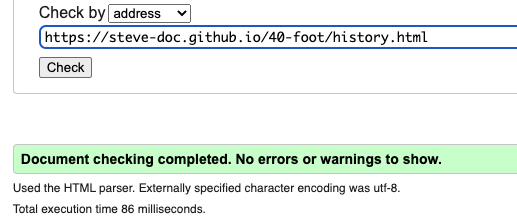
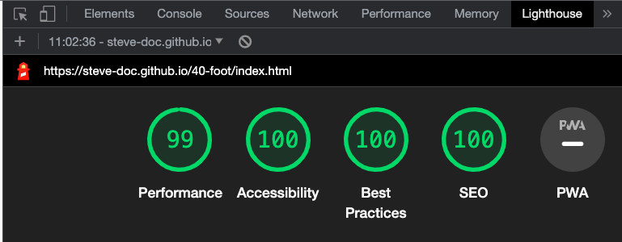
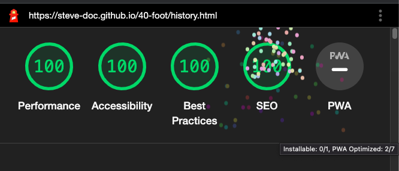

# Forty foot Sea Swimming

## Introduction
A website designed to attract visitors to the historic Forty foot swimming location in Sandycove, Dublin, Ireland.

### Portfolio Project 1 - Stephen Docherty

[Project Repository](https://github.com/steve-doc/40-foot#acknowledge)

[Live Site](https://steve-doc.github.io/40-foot/)

## Table of contents
1. [UX](#ux)
2. [Features](#features)
3. [Technology Used](#technology)
4. [Accessibility Features](#accessibility)
5. [Testing](#testing)
6. [Deployment](#deployment)
7. [Credits](#credits)
8. [Acknowledgements](#acknowledge)

## <a name="ux">UX</a>

###  Strategy

To attract visitors to The Forty Foot swimming facility.  Promoting the benefits of swimming in the sea and specifically this area. Highlighting other attractions and activities and also sharing the unique history of the Forty Foot.

The site provides value to users by sharing the benefits of visiting The Forty Foot, these include health benefits and access to other activities and resources.  Further value is provided by providing a history of the location.  Additionally the user will have the opportunity to sign up a newsletter.  Finally live information about weather, tides and location will all provide value to the user.

Further value may provided to local business providers by link their sites. This may lead to literal value to wedsite owner throught the generation of advertising revenue.

The primary audience for the site will be users interested in taking part in water sports, primarily sea swimming. Also user interested in connecting to nature and healthy living.  A further audience will be attracted by the history of the location and connection to literature. Also user may be attracted to the site when searching for some of the other activitie featured in the Aprés Swim section, such as Killiney Hill or Dun Laoghaire Baths.

#### User Stories

##### Users 
* I want to find out about the benefit of swimming in the sea.
* I want to find out about what makes the Forty Foot unique.
* I want to learn about the history of the Forty Foot.
* I want to find out about what else I can do or see while I am there.
* I want to stay in touch with any interesting events that might be upcoming or learn about other events that has taken place.
* I want to check the weather and tide before I travel to the Forty Foot.
* I want to know how to get there.

##### Site owner
* I want to promote users partaking in a healthy activity.
* I want to promote visitors to the area but 
    * conveying healthy lifestyle choices.
    * uniques history of location
    * promoting popularity of location
* I want give visitors all the information they need to get to location and have a great experience
* I want to promote local businesses and attractions and attract advertising revenue.

### Scope
    Website will
* Provode consistent navigation across pages
* Contain useful information on the benefits of swimming
* Links to the websites of other activities/businesses in the area
* Provide a history of the Forty Foot
* A sign up form for a newsletter with call to action button
* Interactive weather, tides and mapping inserts
* Safety information
* Directions
* Links to social media platforms
* High quality images
* Content will be responsive on different device devices

### Structure

#### Home Page
* Header Bar with Logo and Navigation links
* Hero image
* Healthy Habit Section - Images and benefits of Sea Swimming
* Aprés Swim Section - Images with links to other things to do after swimming
* Footer - Links to Social Media platforms

#### History page
* Header Bar with Logo and Navigation links
* Images with narrative on different aspects of Forty Foot history
* Footer - Links to Social Media platforms

#### About page
* Header Bar with Logo and Navigation links
* Hero image
* Newletter Signup forms with callto action button
* Live Weather insert
* Live Tide insert
* Safety Narrative
* Google map iframe
* Directions narrative
* Footer - Links to Social Media platforms

### Skeleton

### Surface
Aim is to create a theme that is consistent with the Sea and nature and promotes a feeling of wellbeing.

#### Background color
* Header and Footer both use #3a3a3a, a charcole color to frame the body.
* Body uses #A5DFFE.  A light blue green color sampled from the sky of the hero image to creaste consistency and in keeping with the sea theme.
* Have use a darker #6399c9, also sampled from hero image, to frame images and provide contrast tobody background.

#### Font color
* Have consistently used #3a3a3a to contrast with light backgrounds. Softer color than using pure black.
* Have consistently used Ivory to contrast with dark backgrounds.  Again, less urgent than pure white.

#### Fonts
* Using Quicksand for Headings, provides a clean look without disctracting from message.
* Using Hind Madurai for rest of text.  Was recommended as complimentary by https://fontjoy.com/
* Fonts imported from Google Fonts. 
    
#### Logo 
* Created in Canva

## <a name="features">Features</a>

### Existing Features
* #### Nav Bar

The Heading section consists of a Logo, created in Canva, and a Navigation Bar with 3 links.  The Header uses a flex box to align the2 items to the right and left, respectively.  The Nav Bar also uses a flex box to keep the 3 links equally spaced.

The Logo and Nav Bar adjusts size and position based on media queries as screen width decreases.

* #### Hero Image Section

The Hero is a high quality image of the iconic gate at The Forty Foot.

For visual impact an animation has been used to increase the scale of image creating movement when page is opened.

* #### Healthy Habit Section

A section consisting of 4 topics of information on the benefits of visiting The Forty Foot.  Each Topic has an accompanying photograph.  The Secion uses flex box, as does each section within it. The order of the topic/photo is alternated by reversing the order of the flex box rows.

The section flex box switches to column direction and the images size adjusts down at smaller screen sizes.

All images have alt text labels to aid accessability.

* #### Aprés Swim

This section contains a series of links to external web sites with accompanying images and titles.  Arranged in 3 columns for larger screens, adjusting down to 2 the 1 column for smaller screens.

All external links have aria labels to aid accessability and open a seperate window/tab.

* #### Footer

Contains a Navigation Bar and links to external social media sites, both horizantally centered and arranged on above the other.

All external links have aria labels to aid accessability and open a seperate window/tab.

* #### History of 40 Foot Page

Have used same html structure and styling as Health Habit Section on index page.  This page content focuses on history of The Forty Foot, arranged into 4 topics, also consistent with the Healthy Habit section.

* #### Newsletter Form

Simple signup form, consisting of 4 elements - First name, Surname, email address & Newsletter Signup (submit) button.

Form is currently using the Code Institute test site.

The 3 content fields require content before submission is allowed. The Email field checks for correct email format.

The Submit button has been styled in green to stand out as clear call to action.  Pseudo class has been used to reverse color on hover and to create the illusion of pressing movement when selected/active.

* #### Info section with Weather, Tide, Safety, Maps and Directions

Organised into 3 parts
1. A weather widget which fills the width of the screen and is responsive.
2. Live Tide widget and Safety information.
3. Google Map iframe and Directions information

2 & 3 are each flex boxes and are contained within another flex box.  Each moves from row mode to column mode for smaller screens.

### Future Features

The feature below were dererred, partly to stay within the project dealines and also do to likely requiring back end coding skills not yet acquired.

1. Events calendar - I would create an area where local business, sports clubs could post upcoming events
2. News section - Post reports and images from recent events create more of a buzz.
3. Advertising - Posibly integrate into Aprés Swim section adverts from local business promoting their business.  This could presnet revenue generating opportunity.

## <a name="technology">Technology Used</a>
### Html
Used to structure my webpages.

### CSS
Used to provide style, layout and responsiveness to my website.

### Font Awesome
Used for all the social media icons.

### Google Fonts
Used for all the fonts on my website. Fontjoy website was used to find complimentary fonts.

### Forecast7 API
Used to embed interactive live weather widget.

### Tides Today API
Used to embed live tide widget.

### Googlemap API
Used to embed I-frame providing exact location and directions to The Forty Foot.

### Canva
Used to design The Forty Foot logo used in Header.

### XnViewMP Photo Editing Software
Used for sizing, cropping and format coversion of images.

## <a name="accessibility">Accessibility Features</a>

* All images have alt labels
* Any links that take user to external website have aria labels
* Care has been taken to ensure good contrast between text and back ground colors
* Have used semantic html throughout

## <a name="testing">Testing</a>

* ### Functional testing

| Test              | Outcome |
|-------------------|---------------|
|All navigation links take user to correct page|pass|
|All external links open new, correct page|pass|
|Footer navigation and social & social links load correct pages|pass|
|Content reformats on smaller screens|pass|
|Newsletter form submits correctly|pass|
|Newlstter form prevents wrong data types|pass|

* ### User testing

I asked 8 people (friends and colleagues) to test for the following.
* Spelling, grammar and general readability of content.
* Content responsive to different screen sizes.
* All links work.
* Form works.

I also asked them to test the following UX story objectives

* User can find out about the benefit of swimming in the sea.
* User can find out about what makes the Forty Foot unique.
* User can learn about the history of the Forty Foot.
* User can find out about what else they can do or see while there.
* User can stay in touch with any interesting events that might be upcoming or learn about other events that has taken place.
* User can check the weather and tide before travelling to the Forty Foot.
* User can know how to get there.

I also submitted a peer review request to my Code Institute Colleagues.

This was a very productive experience and led me to make a number of small adjustments to the narrative and layout of the content.

Also three specific bugs were highlighted and solved as a result.

1. Google map iframe cause layout issues on mobile screens.  After researching this I figured out that this was due to the iframe not being responsive.  I found some CSS code (accredited below) which resolved the issue.
2. Images not aligning correctl in Aprés Swim section.  I had originally planned to use the same style gallery as used in Love Running project.  However because I wanted the photos to link to external (partner) websites I felt that I needed to add titles under the photos to explain where the link would take the user. I felt this was important to the UX.  When the titles were added the layout was not very pleasing.  I solved this bay resizing the images in XnViewMP photo editing software so the were all the same size.
3. I had noticed that some of the text in the Tidal Widget on the About page was a dark color and badly contrasted with the background color.  I had assumed because it was some imported Javascript that changing the color was outside my skillset at the moment.  However, one of the colleages, (Errors_a_plenty) in the peer review explained how to use inspect to identify that specific selector to target the text.  I implemented this in the style sheet and it resolved the problem.

### Bugs found a fixed
1. On deployment discovered images failed to load.  
    Solved by changing image address to relative rather than absolute.
2. Title under Apres Swim images was overlapping images.
    Solved by adding a container around images and adding padding bottom to image and container.
3. Container border around circular image became eliptical at certain points when screen was narrowed for smaller devices.
    Solved by using media queries to give images and container defined, small width and height at smaller screen sizes.
4. Text on Aprés image titles was bleeding over itself onsmall screen formats. Found during user testing.
    Solved by using media query to switch gallery to single column, 100% width on small screens.
5. Aprés swim images were not aligned correctly and became spaced out on larger screens.
    Solved by resizing all images to the same size and using 100% width.
6. Some lines of text in imported Tidal JavaScript insert on the about page were displaying in a color that wasn't part of my theme.
    Solved after some advise from a colleague during a peer review led me to use inspect to identify the specific identifier to target the text.  Added this to the style sheet and this corrected the problem.
7. Logo overran width of screen on mobile screen.
    Solved using media query and changing image width.
    
### Code and CSS validators

All 3 pages have passed W3C HTML and CSS validators with no errors or warnings.

#### W3C HTML Test passed for index.html

#### W3C HTML Test passed for history.html

#### W3C HTML Test passed for about.html

#### W3C CSS Test passed for index.html

#### W3C CSS Test passed for history.html

#### W3C HTML Test passed for about.html

All three pages were tested with Google Lighthouse with the following results.

#### Lighthouse Result for index.html

#### Lighthouse Result for history.html

#### Lighthouse Result for about.html

Note: Converted all images from png/jpeg to webp as a result of this testing and to improve performance.

## <a name="deployment">Deployment</a>

* The site has been deployed using github pages.
* Live site - https://steve-doc.github.io/40-foot/index.html

## <a name="credits">Credits</a>

### Code

Weather widget - Live weather feed taken from https://forecast7.com/en/53d29n6d12/sandycove/

Tide Widget - Live tidal information taken from https://tides.today/en/c/ireland/county-dublin/dun-laoghaire

Google Map iframe taken from https://www.google.com/maps 
    To make the map iframe responsive found code here https://www.labnol.org/internet/embed-responsive-google-maps/28333/

### Content

History section based on 40ft wikipedia entry https://en.wikipedia.org/wi

### Media

#### Credit for image sources

40-foot-gentlemans-bathing.webp - The Irish Independant https://www.independent.ie/lifestyle/turning-the-tide-30113564.html 

40-foot-women-rights.webp - Meanwhile in Ireland website https://meanwhileinireland.com/on-this-day-irish-women-protested-men-only-bathing-at-the-forty-foot/

40-foot-james-joyce.webp The Art of Dark Pod website https://artofdarkpod.com/the-underbred-james-joyce/

sandycove-beach.webp Dublin Guide https://www.dublinguide.ie/places/sandycove-beach

killiney-hill.webp Curious Ireland https://curiousireland.ie/killiney-obelisk/

sup.webp unsplash.com
wave.ico from favicon wedbsite https://www.favicon.cc/?action=icon&file_id=990257

All other images were taken myself.

### <a name="acknowledge">Acknowledgements</a>

* Mentor - Brian Macharia
* Cohort Facilitator - Special credit to Alan Bushell who gave great support and tips when testing the website.
